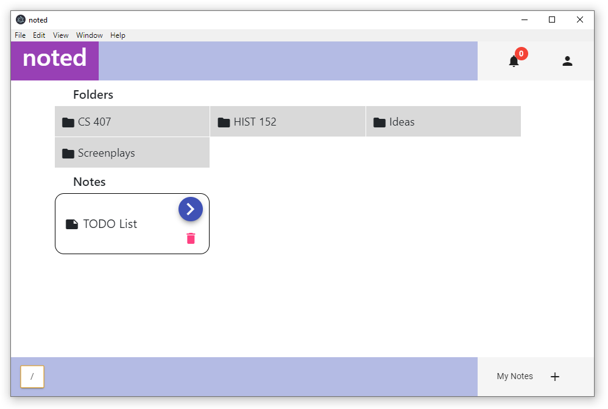
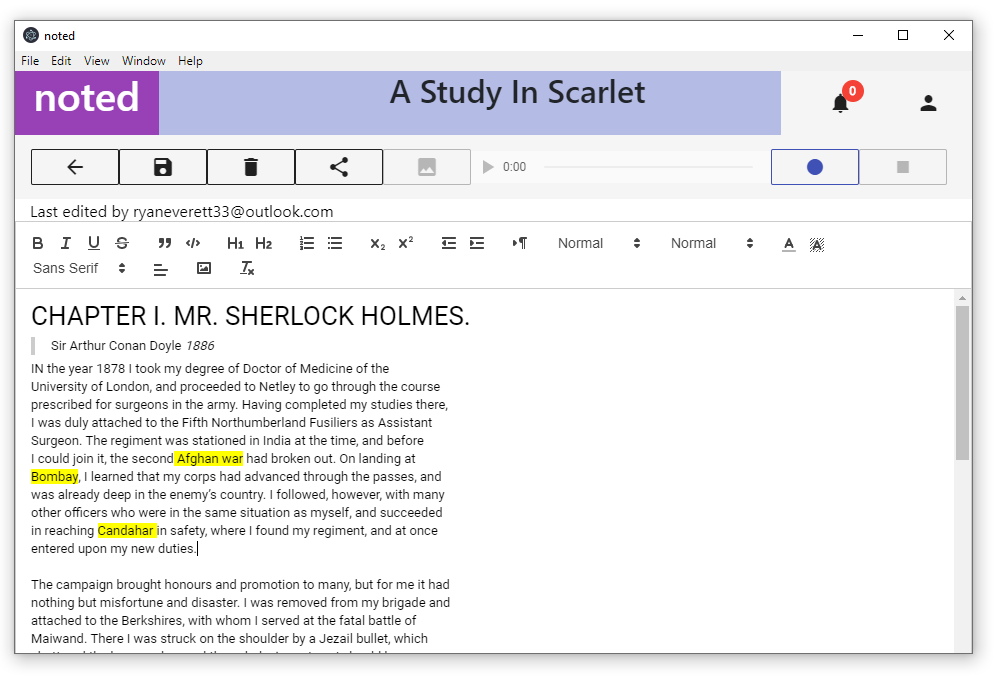
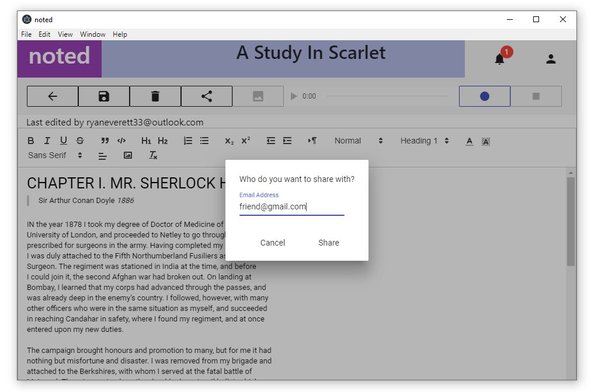
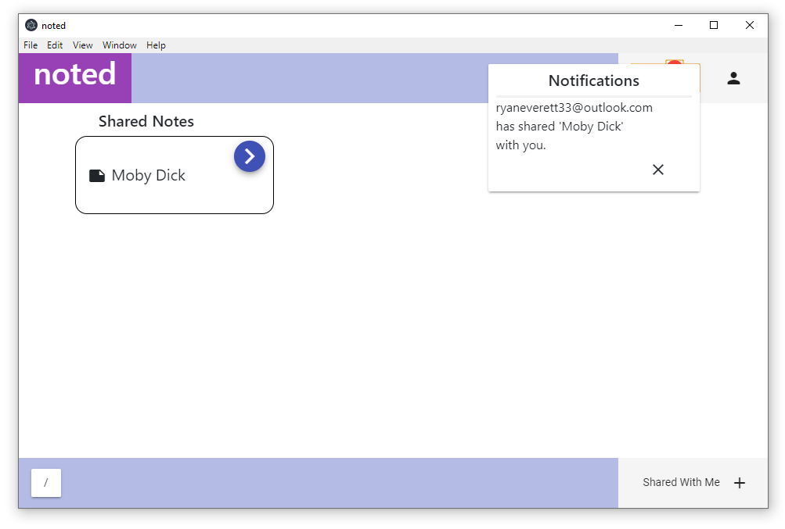

# noted (Electron Application)

This is the Electron codebase for the noted project. If you're looking for the Android version, you made a wrong turn at '/'.

# Features

- Recursive Filesystem for storing your notes and keeping them organized in folders
- Rich text editor for editing your notes
- Sharing notes for real-time collaboration
- Record audio alongside your note taking in case you need to go back in time
- Google login
- Uses Material Design and includes a Dark Mode

# Screenshots

The Homescreen

Editing a Note

Sharing a Note

Notifications and viewing shared notes

## Technologies

- [Firebase](https://firebase.google.com/)
- [Electron](https://electronjs.org/)
- [Angular](https://angular.io/)
- [Quill](https://quilljs.com/)
- [angularfire2](https://github.com/angular/angularfire2)
- [Angular Material](https://material.angular.io/)

## Documentation
Trying to document as much as possible to avoid any confusion. 
[Documentation](documentation/)

## Development

### Setup
`npm install`
`npm install --save-dev electron`

### Running
`npm start`

